#  alss-log

SKALA 알고리즘 스터디 (ALSS)의 문제 풀이 기록 저장소입니다.  
팀원들이 주차별로 문제를 풀이하고, 코드 리뷰를 통해 함께 성장하는 것을 목표로 합니다.

---

<h2>🗂️ 학습 자료</h2>

<!-- 래퍼: 중앙 정렬 -->
<div align="center">

  <!-- 2단 레이아웃 테이블 (왼쪽: 학습표 / 오른쪽: 프로필 그리드) -->
  <table border="0" cellspacing="0" cellpadding="0"
         style="border:0 !important; border-collapse:separate; margin:0 auto; width:100%; max-width:980px;">
    <tr>
      <!-- LEFT: 학습 자료 표 (기존 스타일 유지) -->
      <td valign="top" width="48%" style="border:0 !important; padding:0 12px 0 0;">
        <table border="0" cellspacing="0" cellpadding="6" style="width:100%;">
          <tr>
            <th align="left">주차</th>
            <th align="left">학습자료</th>
            <th align="left">문제 링크</th>
          </tr>
          <tr>
            <td>Week 01</td>
            <td><a href="./docs/study-note-week01.pdf">📄 PDF</a></td>
            <td><a href="./problems/week01">📂 week01</a></td>
          </tr>
          <tr>
            <td>Week 02</td>
            <td><a href="./docs/study-note-week02.pdf">📄 PDF</a></td>
            <td><a href="./problems/week02">📂 week02</a></td>
          </tr>
          <tr>
            <td>Week 04</td>
            <td><a href="./docs/study-note-week04.pdf">📄 PDF</a></td>
            <td><a href="./problems/week04">📂 week04</a></td>
          </tr>
          <tr>
            <td>Week 05</td>
            <td>(예정)</td>
            <td>-</td>
          </tr>
        </table>
      </td>
      <!-- RIGHT: 팀원 프로필 그리드 (테두리 완전 제거) -->
      <td valign="top" width="52%" style="border:0 !important; padding:0;">
        <table role="presentation" border="0" cellspacing="0" cellpadding="0"
               style="border:0 !important; border-collapse:separate; border-spacing:0; width:100%;">
          <tr>
            <td align="center" style="border:0 !important; padding:10px;">
              <a href="https://github.com/nOOne-is-hier" aria-label="GitHub: nOOne-is-hier">
                
              </a><br/>
              <a href="https://solved.ac/profile/kanadachocolate"
                 rel="nofollow noopener noreferrer" aria-label="solved.ac: kanadachocolate">
                
              </a>
            </td>
            <td align="center" style="border:0 !important; padding:10px;">
              <a href="https://github.com/SDGeo12" aria-label="GitHub: SDGeo12">
                
              </a><br/>
              <a href="https://solved.ac/profile/sdgeo20"
                 rel="nofollow noopener noreferrer" aria-label="solved.ac: sdgeo20">
                
              </a>
            </td>
            <td align="center" style="border:0 !important; padding:10px;">
              <a href="https://github.com/jiyunee02" aria-label="GitHub: jiyunee02">
                
              </a><br/>
              <a href="https://solved.ac/profile/jiyun301"
                 rel="nofollow noopener noreferrer" aria-label="solved.ac: jiyun301">
                
              </a>
            </td>
          </tr>
          <tr>
            <td align="center" style="border:0 !important; padding:10px;">
              <a href="https://github.com/skala-changhyun" aria-label="GitHub: skala-changhyun">
                
              </a><br/>
              <a href="https://solved.ac/profile/gcgc09"
                 rel="nofollow noopener noreferrer" aria-label="solved.ac: gcgc09">
                
              </a>
            </td>
            <td align="center" style="border:0 !important; padding:10px;">
              <a href="https://github.com/seo-youngjae" aria-label="GitHub: seo-youngjae">
                
              </a><br/>
              <a href="https://solved.ac/profile/heaven707"
                 rel="nofollow noopener noreferrer" aria-label="solved.ac: heaven707">
                
              </a>
            </td>
            <td align="center" style="border:0 !important; padding:10px;">
              <a href="https://github.com/JinYeopKang" aria-label="GitHub: JinYeopKang">
                
              </a><br/>
              <a href="https://solved.ac/profile/jyyj14587"
                 rel="nofollow noopener noreferrer" aria-label="solved.ac: jyyj14587">
                
              </a>
            </td>
          </tr>
        </table>
      </td>
    </tr>
  </table>

</div>

---

### 📈 참여 진행률 (주차별)



### 🏆 누적 기여 리더보드


### 🌱 성장 곡선 (멤버별·주차 누적)


---

## 🚩 스터디 목적

- 알고리즘 실력 향상 및 문제 해결 능력 강화
- 코드 리뷰를 통한 협업 및 커뮤니케이션 역량 향상
- Git 기반 협업 방식에 익숙해지기

---

## 📁 레포지토리 구조

```bash
alss-log/
├── week01/
│   ├── boj_1000/
│   │   ├── keehwon_1000.cpp
│   │   └── youngjae_1000.py
│   ├── programmers_12900/
│   └── README.md
├── docs/
│   ├── OT.pdf
│   ├── RULES.md
│   └── GIT_GUIDE.md
├── scripts/
│   ├── boj_init.py
│   └── README.md
└── .github/
    ├── PULL_REQUEST_TEMPLATE.md
    └── ISSUE_TEMPLATE/
````

- `weekXX/`: 주차별 문제 풀이 코드 및 요약
- `docs/`: OT, 스터디 규칙, Git 가이드 등의 문서
- `.github/`: PR 템플릿 및 이슈 템플릿 설정

---

## 🧑‍💻 Git 사용 가이드

> PR은 **문제 풀이 코드 제출에만 사용**합니다.
> 그 외의 문서 작업, 리팩토링 등은 운영자가 직접 main 브랜치에 push합니다.

- 브랜치명: `week{주차번호}-{이름}`
  예: `week01-keehoon`
- PR 제목: `:page_facing_up: submit: week{주차번호}-{이름}`
  예: `:page_facing_up: submit: week01-keehoon`
- 파일명: `이름_문제번호.확장자` (예: `keehoon_5597.py`, `keehoon_5597_2.cpp`)

📘 자세한 사용법은 👉 [Git 사용 가이드](./docs/GIT_GUIDE.md)

---

## 📌 스터디 규칙

- 성실하고 열정적으로 학습에 임합니다.
- 모든 문제 풀이가 의무는 아니며, 가능한 범위 내에서 도전합니다.
- 코드 리뷰는 질문과 칭찬을 함께 담아 서로를 성장시킵니다.
- PR 승인 후 브랜치는 삭제합니다.
- 일정이나 참여 관련 문의는 언제든 관리자에게 연락해주세요.

📃 규칙 전문 보기 👉 [스터디 운영 규칙](./docs/RULES.md)

---

## 📝 이슈 활용 안내

- 📢 **공지 또는 완료 보고**: 스터디 진행 상황 공지나 완료된 작업을 공유할 때 사용하세요.
- ❓ **질문하기**: Git, PR, 문제 풀이 등 궁금한 점이 있거나 예외 상황이 있다면 이슈를 등록하세요.
- 💡 **건의사항 제출**: 규칙, 일정, 운영 방식 등에 대한 제안이 있다면 남겨주세요.

> 👉 이슈 생성 시 템플릿이 자동 적용됩니다.

---

## 🛠️ BOJ 문제 자동 세팅 도구

스터디에서는 BOJ 문제를 빠르게 세팅할 수 있는 **Python 스크립트 도구**를 제공합니다.
문제 번호 기반으로 자동으로 **소스 템플릿 + 테스트 입출력 + 실행 러너**까지 만들어 줍니다.

- 자동 생성 항목

  - **소스코드 템플릿**(파일 상단에 **solved.ac 메타** 주석 자동 삽입)
  - `tests/sample*.in|.out` (샘플 I/O), `input.txt`(편의용), **`run.sh`(언어 공통 러너)**
  - (C++ 전용) `.vscode/c_cpp_properties.json`
- 언어별 지원: **C++**, **Python**, **Java**

  - Java 템플릿은 **`class Main`** 기준 (제출 시 `public class Main`로 변경)
- 실행/채점 방법

  - `run.sh` 실행 → **소스 1개 선택 → `tests/*.in` 전부 실행 → 동일 이름의 `.out`와 비교**
  - **C++(Windows)**: `run.sh`가 자동으로 **MSYS2 UCRT64** 셸로 재실행하여 빌드/실행
  - **Python**: UTF-8 강제(`-X utf8`)
  - **Java**: `javac -encoding UTF-8 -d <tmp>` 후 `Main`으로 실행
- 경로 옵션

  - `--dest / --dest-base / BOJ_DEST_BASE` 지원, `--dest +<suffix>`로 기본 경로 뒤에 덧붙이기 가능
- 파일명 규칙(충돌 방지)

  - 일반: `이름_문제번호.확장자`
  - 지정경로 모드: `<문제번호>.<제목_정제>.(cpp|py|java)`
- 팀 저장소 정책

  - 생성 보조물(`run.sh`, `tests/`, `input.txt`, `out/` 등)은 **커밋 대상에서 제외**하도록 `.gitignore` 구성

📘 설치 및 사용법은 👉 [`scripts/README.md`](./scripts/README.md)

---

## ✨ 공식 문서 및 언어별 스타일 가이드

알고리즘 문제 풀이뿐 아니라, **실무 개발과 협업**, **기술 면접**, **장기적인 개발 습관 형성**에 있어  
공식 문서를 적극 활용하고, 언어별 코드 스타일을 익히는 것은 큰 도움이 됩니다.

📘 자세히 보기 👉 [STYLE_GUIDE.md](./docs/STYLE_GUIDE.md)

---

## 🙌 함께 성장하는 스터디

- 문제를 많이 푸는 것보다 **꾸준한 참여와 리뷰가 더 중요합니다.**
- 서로를 존중하며 자유롭게 소통하는 문화를 지향합니다.
- 모르는 것을 부끄러워하지 마세요. 질문이 바로 성장입니다.

---

📬 문의 및 건의: GitHub 이슈를 활용하거나, 슬랙/노션 등을 통해 관리자에게 알려주세요.
